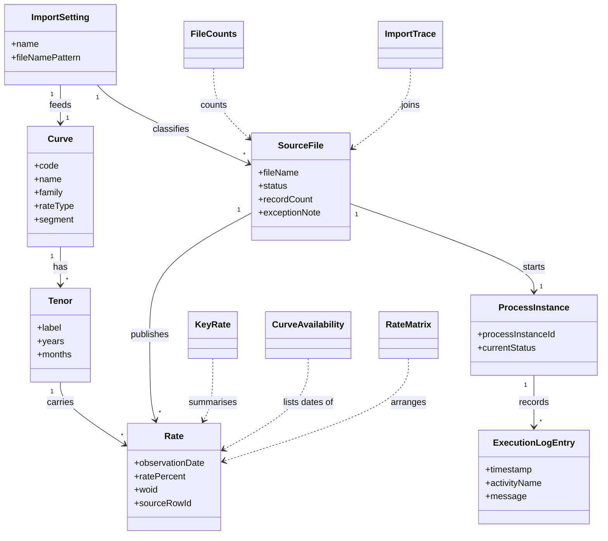

# Requirements: BoE Yield Curve Data Solution

**Domain:** Financial market data management **Target:** prototype **Created:** 2026-10-04 **Status:** final **Last finalised at:** 2026-10-04T11:26:47Z

## In plain terms

**What we found**

- The document specifies a single-role frontend for showing Bank of England yield-curve data: curves, rates by date, comparisons, file status, and traces to workflow runs.
- The frontend reads the live data service, which offers read operations only.
- Importing a source file and production-grade sign-in are out of scope, and the presenter is signed in automatically.

**What it means for you**

- Review the 16 functional requirements and 20 UI needs before you wireframe or prototype; live reads take precedence over the sample-data wording of the prototype invariants.
- To change anything in this document, run `/amend-requirements`.

---

## Contents

- [1. Application context](#1-application-context)
- [1.5 Scope](#15-scope)
- [1.6 Assumptions & dependencies](#16-assumptions-dependencies)
- [1.7 Architectural implications](#17-architectural-implications)
- [1.8 Application character](#18-application-character)
- [2. Domain model](#2-domain-model)
    - [2.1 Concepts](#21-concepts)
    - [2.2 Relationships](#22-relationships)
    - [2.3 Aggregates & lifecycles](#23-aggregates-lifecycles)
        - [Curve](#curve)
        - [Source file](#source-file)
        - [Process instance](#process-instance)
    - [2.4 Diagram (optional)](#24-diagram-optional)
    - [2.5 State-transition matrix](#25-state-transition-matrix)
        - [Source file](#source-file)
        - [Process instance](#process-instance)
- [3. Target users](#3-target-users)
    - [Demo presenter [SRC: C-062]](#demo-presenter-src-c-062)
- [4. User goals & stories](#4-user-goals-stories)
    - [4.1 Goals catalogue](#41-goals-catalogue)
    - [4.2 Stories by persona](#42-stories-by-persona)
        - [Demo presenter](#demo-presenter)
- [5. Task flows](#5-task-flows)
    - [Flow: Explore a curve by observation date](#flow-explore-a-curve-by-observation-date)
    - [Flow: Trace an import from published data](#flow-trace-an-import-from-published-data)
    - [Flow: Follow a failed import to its cause](#flow-follow-a-failed-import-to-its-cause)
- [6. Requirements](#6-requirements)
    - [6.1 Functional](#61-functional)
    - [6.2 Business rules](#62-business-rules)
    - [6.3 Validation rules](#63-validation-rules)
    - [6.4 UI feature needs](#64-ui-feature-needs)
        - [6.4.5 Edge, empty & error states](#645-edge-empty-error-states)
    - [6.5 Access control (RBAC)](#65-access-control-rbac)
    - [6.6 Non-functional (FE-only)](#66-non-functional-fe-only)
        - [6.6.1 Session UX](#661-session-ux)
        - [6.6.2 Frontend performance budgets](#662-frontend-performance-budgets)
        - [6.6.4 Compliance UI behaviour](#664-compliance-ui-behaviour)
        - [6.6.5 Accessibility](#665-accessibility)
    - [6.7 Reporting feature needs](#67-reporting-feature-needs)
    - [6.8 Notification points](#68-notification-points)
    - [6.9 Audit-trail UI feature](#69-audit-trail-ui-feature)
    - [6.10 Consumed backend contracts](#610-consumed-backend-contracts)
        - [Under `target = prototype`](#under-target-prototype)
- [7. Data shapes consumed by the FE](#7-data-shapes-consumed-by-the-fe)
    - [Shape: Curve](#shape-curve)
    - [Shape: Tenor](#shape-tenor)
    - [Shape: Rate](#shape-rate)
    - [Shape: Source file](#shape-source-file)
    - [Shape: Process instance](#shape-process-instance)
    - [Shape: Execution log entry](#shape-execution-log-entry)
    - [7.X Derivations](#7x-derivations)
- [8. Source UI references](#8-source-ui-references)
- [9. Key terminology](#9-key-terminology)
- [10. Volumes](#10-volumes)
- [For downstream use](#for-downstream-use)
- [Prototype invariants](#prototype-invariants)

---
## 1. Application context

**Name:** BoE Yield Curve Data Solution [SRC: C-001]

**Purpose / business value:** Make the ingestion, governance and consumption of Bank of England yield-curve data visible, so the delivery team can show an enterprise-grade architecture working end to end. [SRC: C-002]

**Domain:** Financial market data (UK government and overnight-index yield curves) [SRC: C-003]

**Business goal:** Let the delivery team move from the user interface into the underlying implementation and confidently show the CTO how the solution works. [SRC: C-004]

---

## 1.5 Scope

> §1.5 lists what the application includes, excludes and defers.

| Bucket | Items |
| --- | --- |
| In | Curve and dataset catalogue [SRC: C-005], rates by observation date and tenor [SRC: C-006], by-date rate matrix [SRC: C-007], curve comparison chart [SRC: C-008], overview of latest rates and files [SRC: C-009], import status of source files [SRC: C-010], import audit trail from receipt to publication [SRC: C-011], trace from published data to its source import [SRC: C-012], CSV export of curve rates [SRC: C-013], download of the backed-up source file [SRC: C-014], process instance and execution log viewing [SRC: C-015], links to workflow monitoring [SRC: C-016] |
| Out | Email or secure-file-transfer transport of source files [SRC: C-017], production-grade authorisation [SRC: C-018], an actuarial calculation engine [SRC: C-019], a scripted analytical client [SRC: C-020], importing a source file from within the application |
| Deferred | Present value and future value example on mock actuarial data [SRC: C-021] |

---

## 1.6 Assumptions & dependencies

> Abstract services, persona prerequisites and environment assumptions. Cells naming a product or vendor are not allowed.

| Kind | Statement | Source |
| --- | --- | --- |
| Abstract service dependency | A workflow engine orchestrates validation, transformation and publication; this frontend shows its state and never runs it. [SRC: C-022] | stated |
| Abstract service dependency | A data service exposes curves, tenors, rates, files, process instances and import traces to this frontend as read operations. [SRC: C-023] | stated |
| Environment assumption | The data service is live and reachable from the frontend at http://localhost:10020 during the demonstration. [SRC: C-024] | stated |
| Environment assumption | The frontend reads its data from the live data service at run time. Read operations call the live service and take precedence over the sample-data wording of the prototype invariants, which stay in force for everything else. Sample data is a fallback only. | inferred |
| Environment assumption | Source files arrive from outside the frontend, by email or secure file transfer, and the workflow starts from the received file. [SRC: C-025] | stated |
| Environment assumption | The demonstration needs no formal authorisation, so the application enforces no role restrictions. [SRC: C-026] | stated |
| Persona prerequisite | The application has one role, the demo presenter, who can perform every action. [SRC: C-027] | stated |
| Persona prerequisite | The CTO and the actuarial team are the audience of the demonstration. The demo presenter drives the application. [SRC: C-028] | stated |
| Environment assumption | Each source file is a workbook with an information sheet and four curve sheets: forwards short end, forward curve, spot short end and spot curve. [SRC: C-029] | stated |
| Environment assumption | Dates are given in the form YYYY-MM-DD in UTC. [SRC: C-030] | stated |

---

## 1.7 Architectural implications

> **Application-build guidance.** [PROTO-ONLY] Not a prototype design input; prototype behaviour is governed by PI-01/PI-03/PI-08. [/PROTO-ONLY] Capability categories derived by the drafter from §6 functional requirements + §10 volumes + §6.7 reporting needs, against an inline catalogue of ≤15 categories (see `framework/agents/requirements-drafter.md > derive-architectural-implications`). Every row began as a drafter suggestion that consultant review refined. Recommendation column is **optional** and **non-deterministic** — a stack choice belongs in the code-generation step, not here.

| Capability category | Driving requirement(s) | Recommendation (optional) |
| --- | --- | --- |
| Client-side state management | → §6.1 F-04 "Show the rates of a curve" / → §6.1 F-09 "List source files with paging" |  |
| Client-side search / filtering | → §6.1 F-09 "List source files with paging" / → §6.1 F-12 "List process instances with paging" / → §6.1 F-02 "Browse the curve catalogue" | In-memory index acceptable at ≤10⁴ records |
| Charting / visualisation capability | → §6.1 F-07 "Compare curves across dates or across families" / → §6.1 F-01 "Show the overview of the latest valuation date" |  |
| Real-time updates | → §6.8 NT-01 "Import completed: the status of a source file" |  |
| Export rendering capability | → §6.1 F-08 "Export the rates of a curve" |  |
| Notification delivery surface | → §6.8 NT-01 "Import completed: the status of a source file" / → §6.8 NT-02 "Import failed: the status of a source file" | In-application channel only |
| Audit-trail viewer | → §6.9 Audit-trail UI feature |  |

---

## 1.8 Application character

> The persona/voice of the application's **own user-facing copy** — notifications, error messages, validation messages, confirmations, empty states. Governs tone and phrasing only; what feedback exists, when it appears, and how it is structured remain governed by the standard feedback rules and the design pipelines. This is the application's voice toward its end users — not an agent character, and not a §3 persona.

**Selected character:** Careful operations colleague — calm, precise, plain English; never salesy, never jokey. [SRC: C-031]

**Tone attributes:** calm, precise, plain, trustworthy [SRC: C-032]

| Copy surface | Guidance | Example |
| --- | --- | --- |
| Notifications | The system describes itself neutrally and never celebrates. [SRC: C-033] | "Import complete." [SRC: C-034] |
| Errors | Say what happened, then what to do. Place no blame and use no exclamation marks. [SRC: C-035] | "Sheet ‘4. spot curve’ not found in workbook. Fix the source file or re-import once the Bank of England republishes it." [SRC: C-036] |
| Validation | Name the field and the accepted form. | "Enter the observation date as YYYY-MM-DD." |
| Confirmations | Confirm the action in plain words and name what it produced. | "CSV export prepared." [SRC: C-037] |
| Empty states | Give one factual line that names the missing items. [SRC: C-038] | "No data has been imported for this curve on the chosen date." [SRC: C-039] |

---

## 2. Domain model

> The BA's framing of the business domain in **ubiquitous language**, implementation-free.

### 2.1 Concepts

| Concept | Persistence | Definition (ubiquitous language) |
| --- | --- | --- |
| Curve | persistent | A named yield curve identified by a code, belonging to a family (Nominal, Real, Inflation or OIS), with a rate type (Spot or Forward) and a segment (ShortEnd or Long). [SRC: C-040] |
| Tenor | persistent | A maturity point of a curve, labelled in years and measured in months and years. [SRC: C-041] |
| Rate | persistent | The rate in percent of one tenor on one observation date, traceable to the import and source row that produced it. [SRC: C-042] |
| Source file | persistent | A received spreadsheet logged with its record counts, exception note, content hash and whether it is the current file. [SRC: C-043] |
| Process instance | persistent | One run of the import workflow, with its status, timestamps and steps. [SRC: C-044] |
| Execution log entry | persistent | One logged event of an activity within a process instance. [SRC: C-045] |
| Import setting | policy | The setting that links a source file name pattern to the curve it feeds. [SRC: C-046] |
| Key rate | derived | A headline rate, such as the 10-year nominal and 10-year inflation rate, shown with its change in basis points against the prior day. [SRC: C-047] |
| File counts | derived | The total number of files, the number of current files and the number of failed files. [SRC: C-048] |
| Curve availability | derived | The earliest date, the latest date and the list of observation dates for which a curve has data. [SRC: C-049] |
| Import trace | derived | The link from published data back to its file log entry, workflow instance and the counts of rates and curves produced. [SRC: C-050] |
| Rate matrix | derived | The rates of one curve arranged by observation date and requested tenor. [SRC: C-051] |

### 2.2 Relationships

- Curve **has** Tenor [1..*]
- Tenor **carries** Rate [1..*] (one per observation date)
- Source file **publishes** Rate [1..*]
- Source file **starts** Process instance [1..1]
- Process instance **records** Execution log entry [0..*]
- Import setting **classifies** Source file [1..*]
- Import setting **feeds** Curve [1..1]
- Import trace **joins** Source file, Process instance and Rate [1..1]

### 2.3 Aggregates & lifecycles

#### Curve

| Field | Value |
| --- | --- |
| Member concepts | Curve, Tenor, Rate, Key rate, Curve availability, Rate matrix |
| Lifecycle states | Published |
| Key invariants | A date with no imported data yields an empty rate list, not an error. Every rate is traceable to the import and source row that produced it. Rates are stated in percent. |

#### Source file

| Field | Value |
| --- | --- |
| Member concepts | Source file, Import setting, Import trace, File counts |
| Lifecycle states | Processing → Imported, or Processing → Failed |
| Key invariants | The status is derived, never entered. A failed import keeps an exception note that names the cause. |

#### Process instance

| Field | Value |
| --- | --- |
| Member concepts | Process instance, Execution log entry |
| Lifecycle states | Idle → Running → Finished, with Suspended, Cancelled and Faulted as alternative states |
| Key invariants | Every execution log entry belongs to exactly one process instance. A running process instance ends as Finished, Cancelled or Faulted. |

### 2.4 Diagram (optional)

### 2.5 State-transition matrix

> Emitted only when ≥1 §2.3 aggregate has more than two lifecycle states. One sub-block per qualifying aggregate. Pre-condition cells may reference `→ §6.2 BR-NN`.

#### Source file

| From → To | Trigger | Pre-condition | Visible effect |
| --- | --- | --- | --- |
| Processing → Imported | The workflow instance of the file finishes. [SRC: C-052] | No exception note exists on the file. [SRC: C-053] | The status shows Imported. |
| Processing → Failed | The workflow instance of the file is faulted or cancelled, or the file carries an exception note. [SRC: C-054] | An exception note records the cause, for example Row 12: invalid rate. [SRC: C-055] | The status shows Failed and the exception note becomes visible. |

#### Process instance

| From → To | Trigger | Pre-condition | Visible effect |
| --- | --- | --- | --- |
| Running → Finished | The workflow engine records a finish time. [SRC: C-056] | The process instance is running. [SRC: C-057] | The status shows Finished with a finish time. |
| Running → Faulted | The workflow engine records a fault time. [SRC: C-058] | The process instance is running. [SRC: C-059] | The status shows Faulted with a fault time. |
| Running → Cancelled | The workflow engine records a cancel time. [SRC: C-060] | The process instance is running. [SRC: C-061] | The status shows Cancelled with a cancel time. |

---

## 3. Target users

> Target-user personas — the end users of the application being designed. Not to be confused with the Unicorn (LLM) or the Consultant (audience).

### Demo presenter [SRC: C-062]

| Field | Value |
| --- | --- |
| Role / job title | Runs the demonstration: shows the complete validated ingestion workflow and the data it produces. [SRC: C-063] |
| Expertise level | Knows the solution, its data and the relevant standards well. [SRC: C-064] |
| Stakes | The solution must be real enough to move from the user interface into the underlying implementation and show the CTO how it works. [SRC: C-065] |
| Frequency of use | Once per demonstration, with preparation beforehand. |
| Driving forces — wants | Show how the solution actually works at any point in the demonstration. [SRC: C-066] |
| Driving forces — fears | A demonstration that turns out to be smoke and mirrors. [SRC: C-067] |

---

## 4. User goals & stories

> Quality signals live on the goal (outcome-level), not the story (behaviour-level).

### 4.1 Goals catalogue

| ID | Goal statement | Quality signals | Goal kind | Layout pref (optional) | UX-pattern pref (optional) |
| --- | --- | --- | --- | --- | --- |
| G-01 | Provide a clean web interface showing the structured BoE data [SRC: C-068] | Shows the available curve and dataset, effective date, maturity, relevant rates and import status | top-level | — | — |
| G-02 | Trace a data load from receipt through validation, transformation and publication [SRC: C-069] | A published rate can be followed back to its source file and workflow instance | top-level | — | — |
| G-03 | Make failures and errors traceable [SRC: C-070] | Every failed import shows its cause | sub-level | — | — |
| G-04 | Let an actuary or data scientist retrieve the governed yield-curve data and use it in their own model [SRC: C-071] | Rates for any available date can be viewed and exported | top-level | — | — |
| G-05 | Compare curves across dates and across families [SRC: C-072] | One series appears per curve and date combination | interaction-level | — | — |
| G-06 | Show the audit trail visually, including workflow monitoring and the back-end process workflow [SRC: C-073] | Workflow monitoring can be opened from the application when needed | sub-level | — | — |

### 4.2 Stories by persona

#### Demo presenter

##### Story: As the demo presenter, I want to show a curve's rates for an observation date, so that the audience sees the governed data an actuary or data scientist would use in their own model [SRC: C-074]

| Field | Value |
| --- | --- |
| Goal | → §4.1 G-04 "Let an actuary or data scientist" |
| Priority | Must |
| Objective | See one rate per tenor for a chosen curve and date. |
| Context (frequency / expertise / stakes) | Per demonstration; knows the solution; the rates shown must be real. |
| Linked task flow (optional) | → §5 Flow: Explore a curve by observation date |
| Acceptance criteria | Given a curve and an observation date with data, the rates list shows one entry per tenor. [SRC: C-075] |

##### Story: As the demo presenter, I want to export a curve's rates as a CSV file, so that I can show how an actuary would load them into their own model [SRC: C-076]

| Field | Value |
| --- | --- |
| Goal | → §4.1 G-04 "Let an actuary or data scientist" |
| Priority | Must |
| Objective | Obtain the rates of a curve and date as a file. |
| Context (frequency / expertise / stakes) | Per demonstration; knows the solution; the rates shown must be real. |
| Linked task flow (optional) | → §5 Flow: Explore a curve by observation date |
| Acceptance criteria | Given a curve and an observation date, choosing export provides a CSV file of the rates. [SRC: C-077] |

##### Story: As the demo presenter, I want to compare curves across dates or families, so that the audience can see how the curves move [SRC: C-078]

| Field | Value |
| --- | --- |
| Goal | → §4.1 G-05 "Compare curves across dates and across families" |
| Priority | Should |
| Objective | See several curves in one chart. |
| Context (frequency / expertise / stakes) | Per demonstration; knows the solution; must show real working behaviour. |
| Linked task flow (optional) | → §5 Flow: Explore a curve by observation date |
| Acceptance criteria | Given several curves and dates are chosen, the chart shows one series per curve and date combination. [SRC: C-079] |

##### Story: As the demo presenter, I want to trace published rates back to the import that produced them, so that I can show the audit trail [SRC: C-080]

| Field | Value |
| --- | --- |
| Goal | → §4.1 G-02 "Trace a data load from receipt" |
| Priority | Must |
| Objective | Follow a rate to its source file, workflow instance and counts. |
| Context (frequency / expertise / stakes) | Per demonstration; knows the solution; must show real working behaviour. |
| Linked task flow (optional) | → §5 Flow: Trace an import from published data |
| Acceptance criteria | Given a published rate, the trace shows the file log entry, the workflow instance and the counts of rates and curves produced. [SRC: C-081] |

##### Story: As the demo presenter, I want to show an overview of the latest rates and files, so that the audience understands the data at a glance [SRC: C-082]

| Field | Value |
| --- | --- |
| Goal | → §4.1 G-01 "Provide a clean web interface" |
| Priority | Must |
| Objective | See the latest valuation date, key rates, file counts, spot curves and recent files together. |
| Context (frequency / expertise / stakes) | Per demonstration; knows the solution; must show real working behaviour. |
| Linked task flow (optional) | → §5 Flow: Trace an import from published data |
| Acceptance criteria | Given the overview is opened, the latest valuation date, key rates with their change, file counts, latest spot curves and the last five files are visible. [SRC: C-083] |

##### Story: As the demo presenter, I want to open the workflow monitoring from a process instance, so that I can show the back-end process workflow [SRC: C-084]

| Field | Value |
| --- | --- |
| Goal | → §4.1 G-06 "Show the audit trail visually" |
| Priority | Should |
| Objective | Move from a process instance in the application to the workflow monitoring. |
| Context (frequency / expertise / stakes) | Per demonstration; knows the solution; must show real working behaviour. |
| Linked task flow (optional) | → §5 Flow: Trace an import from published data |
| Acceptance criteria | Given a process instance is open, a link to the workflow monitoring opens when chosen. [SRC: C-085] |

##### Story: As the demo presenter, I want to filter the file list by status, so that I can show which imports are still processing or have failed [SRC: C-086]

| Field | Value |
| --- | --- |
| Goal | → §4.1 G-01 "Provide a clean web interface" |
| Priority | Must |
| Objective | See only the files in one status. |
| Context (frequency / expertise / stakes) | Per demonstration; knows the solution; must show real working behaviour. |
| Linked task flow (optional) | → §5 Flow: Follow a failed import to its cause |
| Acceptance criteria | Given the file list is open, choosing a status shows only files in that status. [SRC: C-087] |

##### Story: As the demo presenter, I want to show why an import failed, so that the audience sees how failures are traced [SRC: C-088]

| Field | Value |
| --- | --- |
| Goal | → §4.1 G-03 "Make failures and errors traceable" |
| Priority | Should |
| Objective | Read the cause of a failed import and open its execution log. |
| Context (frequency / expertise / stakes) | Per demonstration; knows the solution; must show real working behaviour. |
| Linked task flow (optional) | → §5 Flow: Follow a failed import to its cause |
| Acceptance criteria | Given a file has failed, its exception note is shown, for example Row 12: invalid rate. [SRC: C-089] |

##### Story: As the demo presenter, I want to find a process instance by status or process name, so that I can show the workflow run behind any import [SRC: C-090]

| Field | Value |
| --- | --- |
| Goal | → §4.1 G-06 "Show the audit trail visually" |
| Priority | Should |
| Objective | See only the process instances in one status or with one process name. |
| Context (frequency / expertise / stakes) | Per demonstration; knows the solution; must show real working behaviour. |
| Linked task flow (optional) | → §5 Flow: Trace an import from published data |
| Acceptance criteria | Given the process instance list is open, choosing a status or process name shows only matching instances. [SRC: C-091] |

---

## 5. Task flows

### Flow: Explore a curve by observation date

| Field | Value |
| --- | --- |
| Actor | Demo presenter |
| Trigger | The presenter needs to show the rates of a curve for one observation date. [SRC: C-092] |
| Steps | (Choose a curve from the catalogue; its tenors and available dates are shown) → (Choose an observation date; one rate per tenor is shown) → (Compare with other dates or families if wanted; the chart shows one series per combination) → (Export the rates; a CSV file is provided) [SRC: C-093] |
| Decision points | The chosen date has data or has none. [SRC: C-094] |
| Exception paths | {no data for the chosen date → the message "no data imported" → choose another available date} [SRC: C-095] |
| Role-conditional behaviour | None. The application enforces no role restrictions. [SRC: C-096] |

### Flow: Trace an import from published data

| Field | Value |
| --- | --- |
| Actor | Demo presenter |
| Trigger | The presenter wants to show where published rates came from. [SRC: C-097] |
| Steps | (Open a file or rate; its details and identifiers are shown) → (Open the import trace; the file log entry, workflow instance and counts of rates and curves are shown) → (Open the process instance; its steps and execution logs are shown) → (Open the workflow monitoring link; the monitoring opens) [SRC: C-098] |
| Decision points | The presenter opens workflow monitoring when more detail is needed. [SRC: C-099] |
| Exception paths | {trace not found → the message "Import not found" → return to the file list} [SRC: C-100] |
| Role-conditional behaviour | None. The application enforces no role restrictions. [SRC: C-101] |

### Flow: Follow a failed import to its cause

| Field | Value |
| --- | --- |
| Actor | Demo presenter |
| Trigger | An import has failed and its cause must be shown. [SRC: C-102] |
| Steps | (Filter the file list by status Failed; only failed files are listed) → (Open a failed file; its exception note is shown) → (Open its process instance; the steps and the execution logs are shown) → (Read the failing activity message; the cause is identified) [SRC: C-103] |
| Decision points | The file status is Failed. [SRC: C-104] |
| Exception paths | {execution log unavailable → the message "no log entries exist" → return to the file details} |
| Role-conditional behaviour | None. The application enforces no role restrictions. [SRC: C-105] |

---

## 6. Requirements

### 6.1 Functional

| ID | Priority | Statement | Acceptance criteria (EARS) | Source | Rationale (optional) |
| --- | --- | --- | --- | --- | --- |
| F-01 | Must | Show the overview of the latest valuation date, key rates, file counts, latest spot curves and recent files. [SRC: C-106] | When the overview is opened, the system shall show the latest valuation date, key rates, file counts, latest spot curves and recent files. [SRC: C-107] | stated | |
| F-02 | Must | Browse the curve catalogue and filter it by family, rate type and segment. [SRC: C-108] | When the user applies a family, rate type or segment filter, the system shall list only the matching curves. [SRC: C-109] | stated | |
| F-03 | Must | Show the tenors of a curve. [SRC: C-110] | When a curve is opened, the system shall list its tenors with label, years and months. [SRC: C-111] | stated | |
| F-04 | Must | Show the rates of a curve for one observation date. [SRC: C-112] | When a curve and an observation date with data are chosen, the system shall list one rate per tenor. [SRC: C-113] | stated | |
| F-05 | Must | Show the by-date rate matrix of a curve for chosen tenors. [SRC: C-114] | When a date range and tenors are chosen, the system shall show the rate of each observation date for each chosen tenor. [SRC: C-115] | stated | |
| F-06 | Must | Show the observation dates available for a curve. [SRC: C-116] | When a curve is chosen, the system shall offer the earliest date, the latest date and the dates that have data. [SRC: C-117] | stated | |
| F-07 | Should | Compare curves across dates or across families as chart series. [SRC: C-118] | When the user compares curves, the system shall draw one series per curve and date combination. [SRC: C-119] | stated | |
| F-08 | Must | Export the rates of a curve for one observation date as a CSV file. [SRC: C-120] | When the user exports a curve for an observation date, the system shall provide the rates as a CSV file. [SRC: C-121] | stated | |
| F-09 | Must | List source files with paging and filters for status, curve family and received date range. [SRC: C-122] | When the user filters files by status, curve family or received date range, the system shall list only the matching files. [SRC: C-123] | stated | |
| F-10 | Must | Show the details of one source file. [SRC: C-124] | When a file is opened, the system shall show its file name, curve family, received time, size, record counts, status, workflow instance, locations, hash and exception note. [SRC: C-125] | stated | |
| F-11 | Must | Download the backed-up source file. [SRC: C-126] | When the user downloads the original of a file, the system shall return the backed-up source file. [SRC: C-127] | stated | |
| F-12 | Should | List process instances with paging and filters for status and process name. [SRC: C-128] | When the user filters process instances by status or process name, the system shall list only the matching instances. [SRC: C-129] | stated | |
| F-13 | Should | Show a process instance with its steps. [SRC: C-130] | When a process instance is opened, the system shall list its steps with their states. [SRC: C-131] | stated | |
| F-14 | Should | Show the execution logs of a process instance. [SRC: C-132] | When the user opens the execution logs, the system shall list entries with time, activity, event and message, oldest first. [SRC: C-133] | stated | |
| F-15 | Must | Trace published data back to its source import. [SRC: C-134] | When the user traces a rate to its import, the system shall show the file log entry, the workflow instance and the counts of rates and curves produced. [SRC: C-135] | stated | |
| F-16 | Should | Show the exception note of a failed import. [SRC: C-136] | When a file has failed, the system shall show its exception note, for example Row 12: invalid rate. [SRC: C-137] | stated | |

### 6.2 Business rules

| ID | Statement (when / then) | Enforcement point | Acceptance criteria (EARS) | Source | Severity |
| --- | --- | --- | --- | --- | --- |
| BR-01 | When a curve is requested for a date with no imported data, then the user is told that no data was imported instead of seeing an error. [SRC: C-138] | ui | If the observation date has no imported data, then the system shall show the message "no data imported" with an empty rate list. [SRC: C-139] | → §2.3 Curve invariants | major |
| BR-02 | When a file is shown, then its status is derived as Imported, Failed or Processing and is never entered by the user. [SRC: C-140] | cross-layer | When a file is shown, the system shall show exactly one status of Imported, Failed or Processing. [SRC: C-141] | → §2.3 Source file invariants | major |
| BR-03 | When the workflow instance of a file is faulted or cancelled, or the file carries an exception note, then the status is Failed. [SRC: C-142] | cross-layer | If the workflow instance of a file is faulted or cancelled, then the system shall show the status Failed. [SRC: C-143] | → §2.3 Source file invariants | major |
| BR-04 | When the latest workflow instance of a file is finished and the file carries no exception note, then the status is Imported. [SRC: C-144] | cross-layer | When the latest workflow instance of a file is finished, the system shall show the status Imported. [SRC: C-145] | → §2.3 Source file invariants | major |
| BR-05 | When a file is neither finished nor failed, then its status is Processing. [SRC: C-146] | cross-layer | While a file has no finished or failed outcome, the system shall show the status Processing. [SRC: C-147] | → §2.3 Source file invariants | major |
| BR-06 | When a rate is published, then it carries the identifier of the import that produced it and its source row. [SRC: C-148] | cross-layer | When a rate is shown, the system shall allow the user to reach the import that produced it. [SRC: C-149] | → §2.3 Curve invariants | major |
| BR-07 | When a rate is shown, then it is stated in percent. [SRC: C-150] | ui | When a rate is shown, the system shall label its unit as percent. [SRC: C-151] | → §2.3 Curve invariants | minor |
| BR-08 | When a rate matrix is shown, then observation dates are the rows and the requested tenors are the columns. [SRC: C-152] | ui | When a rate matrix is shown, the system shall match each rate to its column by tenor label. [SRC: C-153] | → §6.1 F-05 "Show the by-date rate matrix" | minor |
| BR-09 | When curves are compared, then the comparison runs either across dates for one curve or across families for one date. [SRC: C-154] | ui | When the user compares curves, the system shall leave out any combination that has no imported rates. [SRC: C-155] | → §6.1 F-07 "Compare curves across dates or across families" | minor |
| BR-10 | When the demo presenter uses the application, then every function is available without role restriction. [SRC: C-156] | cross-layer | The system shall make every function available to the demo presenter. [SRC: C-157] | consultant input | minor |
| BR-11 | When a headline rate has no prior day, then its change in basis points is empty. [SRC: C-158] | ui | If a key rate has no prior observation, then the system shall show no change value. [SRC: C-159] | → §7.X Derivations | minor |
| BR-12 | When a workflow step has not run yet, then its state is Pending. [SRC: C-160] | ui | While a step has not run, the system shall show its state as Pending. [SRC: C-161] | → §6.1 F-13 "Show a process instance with its steps" | minor |

### 6.3 Validation rules

> Field-level validation surfaced to the user as inline UI feedback (required-field markers, format hints, range and length errors). Validation runs on blur for simple rules and on submit for cross-field rules. Backend enforcement of business invariants belongs to §6.2 and the sibling backend document; this section captures the visible validation surface only.

| Field (→ §7) | Validation type | Rule | Error message |
| --- | --- | --- | --- |
| Rate.ObservationDate | required | An observation date in the form YYYY-MM-DD, UTC, is needed to show curve rates. [SRC: C-162] | "Enter the observation date as YYYY-MM-DD." |
| Source file.ReceivedAt | format | The received-from and received-to filters use the form YYYY-MM-DD, UTC. [SRC: C-163] | "Enter the date as YYYY-MM-DD." |
| Tenor.Label | format | Tenors for the rate matrix are given as comma-separated tenor labels. [SRC: C-164] | "Separate tenor labels with commas, for example 1Y,5Y,10Y." |

### 6.4 UI feature needs

> *What UI elements and behaviours the FE must provide.* Never layout, position, framework, component name, or visual design. Phrase behaviourally ("user can filter by status", "save action is available"); do not phrase visually. Acceptance criteria stay in observable-signal phrasing.

| ID | Priority | Feature need | Linked (G / story / BR) | Acceptance criteria |
| --- | --- | --- | --- | --- |
| UI-01 | Must | User can see the latest valuation date, the key rates and their change in basis points against the prior day. [SRC: C-165] | → §4.1 G-01 "Provide a clean web interface" | Given the overview is open, the latest valuation date and each key rate with its change are visible. [SRC: C-166] |
| UI-02 | Must | User can see the import status of every source file. [SRC: C-167] | → §4.1 G-01 "Provide a clean web interface" | Given the file list is open, each file shows one status of Imported, Failed or Processing. [SRC: C-168] |
| UI-03 | Must | User can filter the file list by status, curve family and received date range. [SRC: C-169] | → §4.2 Story "As the demo presenter, I want to filter" | Given the file list is open, choosing a status shows only files with that status. [SRC: C-170] |
| UI-04 | Must | User can filter the curve catalogue by family, rate type and segment. [SRC: C-171] | → §6.1 F-02 "Browse the curve catalogue" | Given the catalogue is open, choosing a segment shows only curves of that segment. [SRC: C-172] |
| UI-05 | Must | User can choose a curve and an observation date and see the rate of each tenor. [SRC: C-173] | → §4.1 G-04 "Let an actuary or data scientist" | Given a curve and a date with data, one rate is shown per tenor. [SRC: C-174] |
| UI-06 | Could [SRC: C-175] | User can see a simple yield-curve visualisation. [SRC: C-176] | → §4.1 G-01 "Provide a clean web interface" | Given a curve and a date, rate against tenor is drawn as a line. [SRC: C-177] |
| UI-07 | Should | User can compare curves across dates or across families in one chart. [SRC: C-178] | → §4.1 G-05 "Compare curves across dates and across families" | Given several curves and dates are chosen, one series is drawn per combination. [SRC: C-179] |
| UI-08 | Must | User can export the rates of the shown curve and date as a CSV file. [SRC: C-180] | → §6.1 F-08 "Export the rates of a curve" | Given a curve and a date, choosing export provides a CSV file. [SRC: C-181] |
| UI-09 | Must | User can open the source import trace of a file or rate. [SRC: C-182] | → §4.1 G-02 "Trace a data load from receipt" | Given a file or rate, the trace shows the file log entry, the workflow instance and the counts produced. [SRC: C-183] |
| UI-10 | Should | User can open workflow monitoring links from a process instance. [SRC: C-184] | → §4.1 G-06 "Show the audit trail visually" | Given a process instance is open, a link to workflow monitoring opens when chosen. [SRC: C-185] |
| UI-11 | Should | User can see the steps and execution logs of a process instance. [SRC: C-186] | → §4.1 G-06 "Show the audit trail visually" | Given a process instance is open, its steps and log entries are listed. [SRC: C-187] |
| UI-12 | Must | Lists paginate and offer a page size of 5, 10, 20 or 50 records, with 20 as the default. | → §6.1 F-09 "List source files with paging" | Given a list is open, the page-size choice offers 5, 10, 20 and 50 with 20 selected. |
| UI-13 | Should | Every field of a list can be sorted ascending on first choice and descending on second; the active sort is indicated. | → §6.1 F-09 "List source files with paging" | Given a list, a first choice sorts ascending and a second choice sorts descending. |
| UI-14 | Must | Status values appear as labelled chips whose colour follows intent and is never the only cue. | → §4.1 G-01 "Provide a clean web interface" | Given a status chip, its label is readable without colour. |
| UI-15 | Should | An empty list names its entity. | → §4.1 G-01 "Provide a clean web interface" | Given no files exist, the message names files. |
| UI-16 | Should | A filtered list with no results shows the active filters and a clear-all action. | → §4.1 G-01 "Provide a clean web interface" | Given a filter matches nothing, the active filters and a clear-all action are shown. |
| UI-17 | Should | Loading is indicated by thresholds: nothing under 300 ms, a skeleton up to 3 s, then a skeleton with a message. | → §4.1 G-01 "Provide a clean web interface" | Given a slow response, a skeleton appears after 300 ms. |
| UI-18 | Should | Completed actions appear as transient messages; states needing action appear as persistent messages. | → §6.1 F-08 "Export the rates of a curve" | Given an export completes, a transient message confirms it. |
| UI-19 | Must | User can download the backed-up source file of a file. [SRC: C-188] | → §6.1 F-11 "Download the backed-up source file" | Given a file is open, choosing download returns the backed-up source file. [SRC: C-189] |
| UI-20 | Must | User can see the file counts and the last five files. [SRC: C-190] | → §6.1 F-01 "Show the overview of the latest valuation date" | Given the overview is open, the counts of total, current and failed files and the last five files are visible. [SRC: C-191] |

#### 6.4.5 Edge, empty & error states

> The UI behaviour the user sees in non-happy-path states. Captures empty datasets, partial loads, transient errors, offline degradation, loading affordances, and permission-denied surfaces. Behavioural phrasing only: describe what the user sees and can do, not where it sits on screen.

| Surface (→ story / flow / UI-NN) | Condition | Expected UI behaviour | Recovery action |
| --- | --- | --- | --- |
| → §6.4 UI-05 "User can choose a curve" | empty | The message "no data imported" is shown with an empty rate list. [SRC: C-192] | Choose another date from the dates that have data. [SRC: C-193] |
| → §6.4 UI-03 "User can filter the file list" | empty | The empty list names files. | None needed from the user; the list fills when the first import finishes. |
| → §6.4 UI-03 "User can filter the file list" | partial | The active filters are shown with a clear-all action. | Clear all filters. |
| → §5 Flow: Follow a failed import to its cause | error | The exception note of the failed file is shown. [SRC: C-194] | Open the process instance and its execution logs. [SRC: C-195] |
| → §6.4 UI-11 "User can see the steps" | loading | A skeleton is shown while the data loads. | None needed; the view fills when loading ends. |
| → §6.4 UI-05 "User can choose a curve" | error | A persistent message reports the service error. [SRC: C-196] | Retry the action. |
| → §6.4 UI-19 "User can download the backed-up source file" | error | The message "File not found" is shown when the file record does not exist. [SRC: C-197] | Return to the file list. |
| → §6.4 UI-11 "User can see the steps" | error | The message "Process instance not found" is shown when the process instance does not exist. [SRC: C-198] | Return to the process instance list. |
| → §6.4 UI-09 "User can open the source import trace" | error | The message "Import not found" is shown when no import has the chosen identifier. [SRC: C-199] | Return to the file list. |
| → §6.4 UI-05 "User can choose a curve" | permission-denied | An in-page message states that the request was not authorised and names a path to request access. [SRC: C-200] | Follow the request-access path. |

### 6.5 Access control (RBAC)

> Roles-×-resources matrix. Cell values use the action vocabulary below; blanks mean "no access".

**Action vocabulary:** `C` create · `R` read · `U` update · `D` delete · `X` execute / invoke · `A` approve · `—` no access. Suffix with a BR ref for conditional access (e.g. `U†BR-07` = update gated by BR-07).

The application has one role, so the demo presenter holds every action (→ §6.2 BR-10 "When the demo presenter uses the application"). Scoped actions map the task flows to matrix cells:

- `X` on Rate covers the flow "Explore a curve by observation date" (compare and export).
- `X` on Source file covers the flow "Trace an import from published data" and the download of the backed-up original.
- `R` on Source file, Process instance and Execution log entry covers the flow "Follow a failed import to its cause".

| Role (→ §3) | Curve | Tenor | Rate | Source file | Process instance | Execution log entry |
| --- | --- | --- | --- | --- | --- | --- |
| Demo presenter | R [SRC: C-201] | R [SRC: C-202] | R X [SRC: C-203] | R X [SRC: C-204] | R [SRC: C-205] | R [SRC: C-206] |

### 6.6 Non-functional (FE-only)

> Frontend NFRs only. Backend availability / throughput / persistence concerns live in the sibling backend document.

#### 6.6.1 Session UX

> **Application-build guidance.** [PROTO-ONLY] Not a prototype design input; prototype behaviour is governed by PI-01/PI-03 — server + auth are simulated, so this policy table binds the production application, not the prototype. [/PROTO-ONLY]

| Field | Value | Source |
| --- | --- | --- |
| Idle session timeout | 15 minutes | inferred |
| Absolute session timeout | 8 hours | inferred |
| Idle warning lead-time | 60 seconds | inferred |
| Re-auth scope | Approve-class actions; the application has none today | inferred |
| Account lockout messaging | Not applicable. A sign-in screen exists and signs the demo presenter in automatically, as if single sign-on were used, without authenticating; no failed sign-in attempts occur. [SRC: C-207] | stated |
| MFA prompt scope | None. No second sign-in factor is requested; sign-in is automatic for the demo presenter. [SRC: C-208] | stated |

#### 6.6.2 Frontend performance budgets

> **Application-build guidance.** [PROTO-ONLY] Not a prototype design input; prototype behaviour is governed by PI-08 — the prototype is a review harness, never perf-optimised, so these budgets bind the production application. [/PROTO-ONLY]

| Metric | Target | Source |
| --- | --- | --- |
| Time to interactive (p95) | ≤ 3.0 s on a typical office connection | inferred |
| Initial bundle size budget | ≤ 300 KB gzipped | inferred |
| Render budget for largest list/table | ≤ 500 ms for 200 records at p95 | inferred |
| Time to meaningful content | ≤ 2.0 s at p95 | inferred |

#### 6.6.4 Compliance UI behaviour

- None specified.

#### 6.6.5 Accessibility

- Status is conveyed by label and icon as well as colour.
- Icon-only controls carry a text label that screen readers announce.

### 6.7 Reporting feature needs

> Each row captures *what reporting must exist*, never *how it is visualised*. Chart type, layout, and visualisation choice are determined by the later UX step.

| ID | Purpose | Audience (→ §3) | Source concept(s) (→ §2.1) | Filter dimensions | Measures / columns | Export formats | Scheduling |
| --- | --- | --- | --- | --- | --- | --- | --- |
| RPT-01 | Extract the rates of one curve for one observation date. [SRC: C-209] | Demo presenter [SRC: C-210] | Curve, Tenor, Rate [SRC: C-211] | Curve and observation date [SRC: C-212] | Tenor label, tenor years and rate in percent [SRC: C-213] | csv [SRC: C-214] | on-demand |
| RPT-02 | Compare the rates of one curve across observation dates and tenors. [SRC: C-215] | Demo presenter [SRC: C-216] | Curve, Tenor, Rate [SRC: C-217] | Curve, observation date range and tenors [SRC: C-218] | Rate in percent per observation date and tenor [SRC: C-219] | none | on-demand |

### 6.8 Notification points

> Channel category is capability-level only (`in-app`, `email`, `sms`, `webhook`, `push`); never a vendor name. Trigger condition may reference a `BR-NN`.

| ID | Event | Audience (→ §3) | Channel category | Trigger condition |
| --- | --- | --- | --- | --- |
| NT-01 | Import completed: the status of a source file becomes Imported. [SRC: C-220] | Demo presenter [SRC: C-221] | in-app | → §6.2 BR-04 "When the latest workflow instance of a file" |
| NT-02 | Import failed: the status of a source file becomes Failed. [SRC: C-222] | Demo presenter [SRC: C-223] | in-app | → §6.2 BR-03 "When the workflow instance of a file" |

### 6.9 Audit-trail UI feature

> Emitted only when §6.6.4 compliance or input documents call for user-visible audit history. Backend audit logging is out of scope; this section specifies the *viewer UI* only.

| Entity (→ §7) | Audited fields | Retention surface | Viewer access (→ §6.5) |
| --- | --- | --- | --- |
| Source file | Received time, status, record counts, exception note, content hash and created-by user. [SRC: C-224] | All history stays visible in the file list and file details. | Demo presenter (→ §6.5 Access control (RBAC)) |
| Process instance | Status, timestamps, last executed activity, steps and execution logs. [SRC: C-225] | All history stays visible in the process instance list and details. | Demo presenter (→ §6.5 Access control (RBAC)) |

### 6.10 Consumed backend contracts

> FE-facing only: the backend operations this frontend consumes. [PROTO-ONLY] The drafter emits one sub-block matching `manifest.target`; the merger does not see both. (The application sub-block is produced at export time by `/export-application`, or by a legacy application-target manifest run.) [/PROTO-ONLY]

#### Under `target = prototype`

| Operation | Fixture reference | Notes |
| --- | --- | --- |
| OverviewGet [SRC: C-226] | `fixtures/overview.json` | Served at GET /v1/overview. Supports → §6.1 F-01 "Show the overview of the latest valuation date" |
| FileGetList [SRC: C-227] | `fixtures/files.json` | Served at GET /v1/files. Supports → §6.1 F-09 "List source files with paging" |
| FileGetById [SRC: C-228] | `fixtures/file-detail.json` | Served at GET /v1/files/{Id}. Supports → §6.1 F-10 "Show the details of one source file" |
| FileOriginalDownload [SRC: C-229] | `fixtures/file-original.xlsx` | Served at GET /v1/files/{Id}/original. Supports → §6.1 F-11 "Download the backed-up source file" |
| CurveGetList [SRC: C-230] | `fixtures/curves.json` | Served at GET /v1/curves. Supports → §6.1 F-02 "Browse the curve catalogue" |
| CurveTenorGetList [SRC: C-231] | `fixtures/tenors.json` | Served at GET /v1/curves/{Code}/tenors. Supports → §6.1 F-03 "Show the tenors of a curve" |
| CurveRateGetList [SRC: C-232] | `fixtures/rates.json` | Served at GET /v1/curves/{Code}/rates. Supports → §6.1 F-04 "Show the rates of a curve" |
| CurveRateMatrixGet [SRC: C-233] | `fixtures/rate-matrix.json` | Served at GET /v1/curves/{Code}/rate-matrix. Supports → §6.1 F-05 "Show the by-date rate matrix" |
| CurveAvailabilityGet [SRC: C-234] | `fixtures/availability.json` | Served at GET /v1/curves/{Code}/availability. Supports → §6.1 F-06 "Show the observation dates available" |
| CurveCompareGet [SRC: C-235] | `fixtures/compare.json` | Served at GET /v1/curves/compare. Supports → §6.1 F-07 "Compare curves across dates or across families" |
| CurveRatesDownload [SRC: C-236] | `fixtures/rates.csv` | Served at GET /v1/curves/{Code}/rates.csv. Supports → §6.1 F-08 "Export the rates of a curve" |
| ProcessInstanceGetList [SRC: C-237] | `fixtures/process-instances.json` | Served at GET /v1/process-instances. Supports → §6.1 F-12 "List process instances with paging" |
| ProcessInstanceGetById [SRC: C-238] | `fixtures/process-instance-detail.json` | Served at GET /v1/process-instances/{Id}. Supports → §6.1 F-13 "Show a process instance with its steps" |
| ProcessInstanceExecutionLogGetList [SRC: C-239] | `fixtures/execution-logs.json` | Served at GET /v1/process-instances/{Id}/execution-logs. Supports → §6.1 F-14 "Show the execution logs of a process instance" |
| ImportGetByWoid [SRC: C-240] | `fixtures/import-trace.json` | Served at GET /v1/imports/{Woid}. Supports → §6.1 F-15 "Trace published data back to its source" |

---

## 7. Data shapes consumed by the FE

> Shape of data the FE reads and writes: the payloads exchanged with the backend, whose authoritative definition lives in the sibling backend requirements document. [PROTO-ONLY] Under `target = prototype` that shape is realized as in-memory fixtures (PI-02). [/PROTO-ONLY] Persistence design — indexes, FK constraints, storage layout — is the backend doc's concern, not this section's.

### Shape: Curve

| Field | Type | Required | UI-display | Notes |
| --- | --- | --- | --- | --- |
| Id [SRC: C-241] | integer | yes | hidden | Internal identifier. |
| Code [SRC: C-242] | string | yes | detail | Unique curve code, for example GlcNominalSpotCurve. |
| Name [SRC: C-243] | string | yes | table-col | Display name of the curve. |
| CurveFamily [SRC: C-244] | string | yes | chip | Nominal, Real, Inflation or OIS. |
| RateType [SRC: C-245] | string | yes | chip | Spot or Forward. |
| Segment [SRC: C-246] | string | yes | chip | ShortEnd or Long. |
| RateUnit [SRC: C-247] | string | yes | detail | Percent. |
| Provider [SRC: C-248] | string | yes | detail | The publisher of the curve. |

**Domain concept:** → §2.1 Curve
**Source:** prototype-fixture
**Enums:** CurveFamily = Nominal / Real / Inflation / OIS; RateType = Spot / Forward; Segment = ShortEnd / Long

### Shape: Tenor

| Field | Type | Required | UI-display | Notes |
| --- | --- | --- | --- | --- |
| TenorId [SRC: C-249] | integer | yes | hidden | Internal identifier. |
| Label [SRC: C-250] | string | yes | table-col | For example 10Y. |
| Years [SRC: C-251] | number | yes | table-col | Maturity in years. |
| Months [SRC: C-252] | integer | yes | detail | Maturity in months. |
| SourceColumn [SRC: C-253] | string | yes | detail | Name of the source spreadsheet field. |

**Domain concept:** → §2.1 Tenor
**Source:** prototype-fixture
**Enums:** none

### Shape: Rate

| Field | Type | Required | UI-display | Notes |
| --- | --- | --- | --- | --- |
| ObservationDate [SRC: C-254] | string | yes | table-col | Form YYYY-MM-DD, UTC. |
| TenorLabel [SRC: C-255] | string | yes | table-col | For example 10Y. |
| TenorYears [SRC: C-256] | number | yes | table-col | Maturity in years. |
| RatePercent [SRC: C-257] | number | yes | table-col | Rate in percent. |
| SourceRowId [SRC: C-258] | integer | yes | detail | Row of the source spreadsheet that produced the rate. |
| Woid [SRC: C-259] | string | yes | detail | Work object identifier of the import. |

**Domain concept:** → §2.1 Rate
**Source:** prototype-fixture
**Enums:** none

### Shape: Source file

| Field | Type | Required | UI-display | Notes |
| --- | --- | --- | --- | --- |
| Id [SRC: C-260] | integer | yes | detail | File identifier. |
| FileName [SRC: C-261] | string | yes | table-col | For example GLC Nominal daily data current month.xlsx. |
| CurveFamily [SRC: C-262] | string | yes | chip | Derived by matching the import setting name to the curve code. |
| ReceivedAt [SRC: C-263] | string | yes | table-col | Date and time received. |
| SizeBytes [SRC: C-264] | number | no | table-col | Size in bytes; can be absent and is transmitted as text. |
| RecordCount [SRC: C-265] | integer | yes | table-col | Records found in the file. |
| RecordsInserted [SRC: C-266] | integer | no | table-col | Records published; can be absent and is transmitted as text. |
| Woid [SRC: C-267] | string | yes | detail | Work object identifier of the import. |
| Status [SRC: C-268] | string | yes | chip | Imported, Failed or Processing; derived, never stored. |
| IsCurrent [SRC: C-269] | boolean | yes | chip | Whether this is the current file. |
| WorkflowInstanceId [SRC: C-270] | string | yes | detail | The workflow instance that imported the file. |
| InboxLocation [SRC: C-271] | string | no | detail | Where the file arrived. |
| BackupFileName [SRC: C-272] | string | no | detail | Name of the backed-up copy. |
| Sha256 [SRC: C-273] | string | no | detail | Content hash of the file. |
| ExceptionNote [SRC: C-274] | string | no | detail | Cause of a failed import, for example Row 12: invalid rate. |
| CreatedBy [SRC: C-275] | string | no | detail | User who created the file record. |

**Domain concept:** → §2.1 Source file
**Source:** prototype-fixture
**Enums:** Status = Imported / Failed / Processing

### Shape: Process instance

| Field | Type | Required | UI-display | Notes |
| --- | --- | --- | --- | --- |
| ProcessInstanceId [SRC: C-276] | string | yes | detail | Identifier of the workflow run. |
| ProcessName [SRC: C-277] | string | yes | table-col | For example ImportCurveFile. |
| ContextId [SRC: C-278] | string | yes | detail | The work object identifier of the import. |
| CurrentStatus [SRC: C-279] | string | yes | chip | One of Idle, Running, Suspended, Finished, Cancelled or Faulted. |
| CreatedAt [SRC: C-280] | string | yes | table-col | Date and time created. |
| LastExecutedAt [SRC: C-281] | string | no | table-col | Date and time of the last activity. |
| FinishedAt [SRC: C-282] | string | no | detail | Date and time finished. |
| CancelledAt [SRC: C-283] | string | no | detail | Date and time cancelled. |
| FaultedAt [SRC: C-284] | string | no | detail | Date and time faulted. |
| LastExecutedActivityName [SRC: C-285] | string | no | detail | For example PublishRates. |
| Steps [SRC: C-286] | list of step | no | detail | Each step has a name and a state of Pending, Running, Completed or Faulted. |

**Domain concept:** → §2.1 Process instance
**Source:** prototype-fixture
**Enums:** CurrentStatus = Idle / Running / Suspended / Finished / Cancelled / Faulted; Step state = Pending / Running / Completed / Faulted

### Shape: Execution log entry

| Field | Type | Required | UI-display | Notes |
| --- | --- | --- | --- | --- |
| Timestamp [SRC: C-287] | string | yes | table-col | Date and time of the event. |
| ActivityName [SRC: C-288] | string | yes | table-col | For example PublishRates. |
| EventName [SRC: C-289] | string | yes | table-col | For example Completed. |
| Message [SRC: C-290] | string | no | table-col | For example Published 250 rates. |

**Domain concept:** → §2.1 Execution log entry
**Source:** prototype-fixture
**Enums:** none

### 7.X Derivations

> Emitted only when ≥1 §2.1 concept has `Persistence = derived`. Derivation rule phrased in business language; computation tier is determined at code-generation time (capability category appears in §1.7 if non-trivial).

| Derived concept (→ §2.1) | Derivation rule (business language) | Inputs | Refresh trigger |
| --- | --- | --- | --- |
| Key rate | The 10-year nominal and 10-year inflation rate of the latest valuation date, with the change in basis points against the prior day. [SRC: C-291] | Rate, Curve, Tenor | on-load |
| File counts | The total number of files, the number of current files and the number of failed files. [SRC: C-292] | Source file | on-load |
| Curve availability | The earliest date, the latest date and every observation date that has rates for the curve. [SRC: C-293] | Rate, Curve | on-load |
| Import trace | The file log entry, the workflow instance and the counts of rates and curves produced by one import. [SRC: C-294] | Source file, Process instance, Rate | on-load |
| Rate matrix | The rates of one curve with observation dates as one axis and the requested tenors as the other. [SRC: C-295] | Rate, Tenor, Curve | on-change |

---

## 8. Source UI references

> Omitted entirely when no consultant-supplied UI reference exists (§0.1 content-conditional).

| Reference | Location | Notes |
| --- | --- | --- |
| Genwood Yield prototype (clickable) | `documentation/Genwood Yield prototype/Genwood Yield.dc.html` | A signal for the *how*, not authoritative. Sign-in screen with an automatic demo sign-in. Navigation: Overview, File log, Curve data, Yield curves, Workflow monitor, API. Overview shows four key figures, a spot-curve chart and recent loads. File log filters by status and opens a file detail with an exception message. Curve data offers by-maturity and by-date views with CSV export. Yield curves compare across dates or families. Workflow monitor shows seven workflow steps and an execution log. An import dialog simulates a file arriving; see §9 for how this differs from the live data service. |
| Genwood design system (UI kit) | `documentation/Genwood Design System/ui_kits/genwood-app/` | A signal for the *how*. Screens: file log with status tabs and filters, and file detail with a table or chart view. Further screens: a dense date-by-maturity data grid, yield curves compared across up to five dates, and an import dialog. The shell uses a forest-green top bar, a side navigation and sentence-case copy. |
| Genwood design system (brand and tokens) | `documentation/Genwood Design System/readme.md` and `tokens/` | A signal for brand look and feel, consumed by the design-system and prototype pipelines. Forest green is the brand colour, with warm stone neutrals. Muted moss, ochre, clay and slate carry status and chart series. A sans-serif face serves the interface and a monospaced face serves numbers, dates and file names. |

---

## 9. Key terminology

> **Inconsistency register, not a glossary.** Record only terms where the consultant uses an alternate label or the inputs disagree — the canonical, complete domain glossary is produced separately by the GLOSSARY methodology (`generated-docs/analyse-requirements/GLOSSARY/`). Omitted entirely when no inconsistency applies (§0.1 content-conditional).

| Term | Definition | Inconsistency flag |
| --- | --- | --- |
| Genwood | The client organisation named in the demonstration title. | consultant_uses_alternate: the meeting notes say "Jenwood" |
| Demo presenter | The one role of the application, who runs the demonstration. | consultant_uses_alternate: the prototype signs the user in as "Demo user" |
| BoE Yield Curve Data Solution | The solution named in the demonstration brief. | consultant_uses_alternate: the design system calls the first product "Genwood Yield" |
| Authorisation | The demonstration enforces no role restrictions. | inputs_disagree: the data service contract lists an Unauthorized response on every operation, while the call notes say formal authorisation is not needed |
| Source file import | How a source file reaches the application. | inputs_disagree: the call notes allow a website file pickup or upload and the prototype has an import dialog, while the data service contract has no write operation |
| Data service contract | The operations the frontend consumes. | inputs_disagree: the prototype shows an illustrative contract with different paths, while the live contract in CurveData.yaml uses /v1 paths |

---

## 10. Volumes

> Volumes drive UI pattern selection only — pagination thresholds, virtualization choices, list-vs-card density, chart-type suitability. Capacity planning, infrastructure sizing, and load testing belong to the backend doc.

| Metric | Value | Source |
| --- | --- | --- |
| Data volume | 16 curves in four families. [SRC: C-296] | stated |
| Frequency | One new observation date per business day for each curve. [SRC: C-297] | stated |
| Concurrency | 1 concurrent user. | inferred |

---

## For downstream use

<!-- format: framework-internal reference; not a requirement. Kept at the foot, out of the human reading path, because downstream consumers read it. -->

> Nothing below this heading is a requirement. This section is framework-internal reference material retained for the agents that read this document.

## 0.1 Target-mode applicability

<!-- format: table[4-col: section, prototype, application, mode-conditional?]; one row per mode-conditional section -->

> The `target` field on the source manifest is `prototype` (every pipeline run; auto-set at the orchestrator's Step 1b) or `application` (legacy manifests only — the drafter no longer has a consultant-chosen application emit mode). The `application` column below therefore describes the **exported** document produced by `/export-application` from the finished pipeline doc, plus the dormant legacy-manifest behaviour. (This §0.1 section itself does **not** survive the export — `/export-application` replaces it with a short `## 0.1 Document scope` note, since manifests and the merger are framework-internal concepts for an external audience. The scope-note blockquotes below carry their prototype-scoping sentence inside a paired `PROTO-ONLY` scope span, which the export deletes whole; each is additionally pinned by a `<!-- verbatim: -->` directive, so the drafter must copy it byte-for-byte. Changing one here changes what the drafter emits — there is no separate predicate in the exporter to keep in sync any more, but the drafter's pinned-scope-note self-validation compares against **this** file.) Rows marked *scope-noted* are emitted in **every** pipeline doc with an application-build-guidance blockquote ("not a prototype design input"). Rows marked *content-conditional* are omitted when they have no content under either target.

| Section | `prototype` | `application` | Mode-conditional? |
| --- | --- | --- | --- |
| §1.6 Assumptions & dependencies | omitted when no assumption/dependency applies | emitted | yes — content-conditional |
| §1.7 Architectural implications | emitted (drafter-derived; scope-noted) | carried through at export | no — scope-noted |
| §1.8 Application character | emitted (voice for the app's own user-facing copy; input-stated or consultant-resolved) | carried through at export | no |
| §6.1 `Rationale` column | column emitted (optional, per-cell) | same | no |
| §6.6.1 Session UX | emitted (scope-noted) | carried through at export | no — scope-noted |
| §6.6.2 FE performance budgets | emitted (scope-noted) | carried through at export | no — scope-noted |
| §6.10 Consumed backend contracts | fixture references | pointers into the sibling backend requirements document — produced at export or under a legacy application manifest | yes — sub-block content differs |
| §7 Data shapes consumed by FE | shape sourced from fixtures | shape sourced from backend contracts | provenance label only |
| §8 Source UI references | omitted when no consultant-supplied reference exists | same | yes — content-conditional |
| §9 Key terminology | omitted unless ≥1 inconsistency flag or alternate-term usage exists (full domain glossary lives in the GLOSSARY analysis, not here) | same | yes — content-conditional |
| `## Prototype invariants` appendix | appended (PI-01..PI-08) | omitted | yes — merger conditional |
| (all other sections) | identical | identical | no |

> **Reading this document.** Cells never name a framework, library, vendor or product; they describe capability categories. The UI sections say what must exist, never how it is arranged or styled. An inline `[SRC: C-NNN]` tag cites the input a value comes from; the claims file holds the verbatim quotes. Text wrapped in a `PROTO-ONLY` span is true of the prototype only.

## Prototype invariants

### PI-01 — Server behaviour is simulated

All server-side behaviour — authentication, API calls, database operations, third-party integrations, scheduled jobs — is simulated by client-side stubs. Backend-shaped requirements describe the user-visible behaviour the simulation must reproduce, not real implementation. Endpoints, middleware, message queues, and infrastructure are out of scope.

### PI-02 — Data is fixture-backed

All data displayed in the prototype is sourced from in-memory fixtures shipped with the build. Mutations persist within a session but do not survive a reload unless an explicit "demo data" mode is specified. There is no real database, no migrations, and no data import / export pipelines.

### PI-03 — Validation is visual only

Form-field validation messages and inline error feedback are rendered as specified by the requirements, but no server-side enforcement is exercised. Constraints that are not visible in the UI — uniqueness checks, referential integrity, rate limiting, idempotency — are not run, even when the requirements name them.

### PI-04 — Third-party integrations are visual

Email, SMS, payment, mapping, file storage, and analytics integrations appear in the UI as visual confirmations or placeholder content. No external network calls are made. Where the requirements describe a third-party flow, the prototype reproduces the user-visible steps and the resulting UI state, not the network exchange.

### PI-05 — Role switcher

Every screen accessible to more than one role displays a role switcher in the prototype's surrounding chrome — outside the application UI under design — so reviewers can inspect each role's view without re-authenticating. The switcher is clearly labelled as a prototype tool, not an in-app control, and is placed in the same position on every screen. It lists every role defined in §3 of the requirements; roles to whom the active screen is not accessible per §6.5 RBAC are rendered in a disabled state. Switching the active role must immediately update the screen's visible components and actions to match the rules captured in the requirements (RBAC entries, conditional visibility, role-gated actions).

### PI-06 — Backend contracts are imaginary

Under the prototype target, the §6.10 fixture references *are* the backend; the §7 data shapes are the contract. There is no sibling backend specification, no live integration, and no contract-compatibility check. When §6.10 lists `Operation → Fixture reference`, the prototype reads and writes that fixture; mutations follow PI-02 (in-session persistence only). Application-target requirements specs replace these fixtures with pointers into a separate backend requirements document — those pointers are out of scope for the prototype build.

### PI-07 — Reporting is fixture-replayed

§6.7 reporting feature needs render from fixture aggregates only. No live computation, no aggregation pipeline, no scheduled materialisation, no export-side rendering. Filter dimensions and measure columns are honoured against the in-memory fixture; export formats produce the file from the same in-memory state. Reports listed with `Scheduling = daily / etc.` are visualised as scheduled in the UI (next-run timestamp, history entries) but do not execute on a clock.

### PI-08 — Prototype chrome is a review harness

The prototype's surrounding chrome — role switching (PI-05), data reset, prototype metadata (scope / purpose / posture), and navigation between generated prototypes — sits **outside** the application UI under design and is **not part of any requirement**. It is clearly marked as a prototype tool, carries no requirement bindings (no `data-src` / `data-prop`), and exists solely so reviewers can inspect and compare the generated designs. Nothing in the chrome should be read as a feature of the product being specified.
